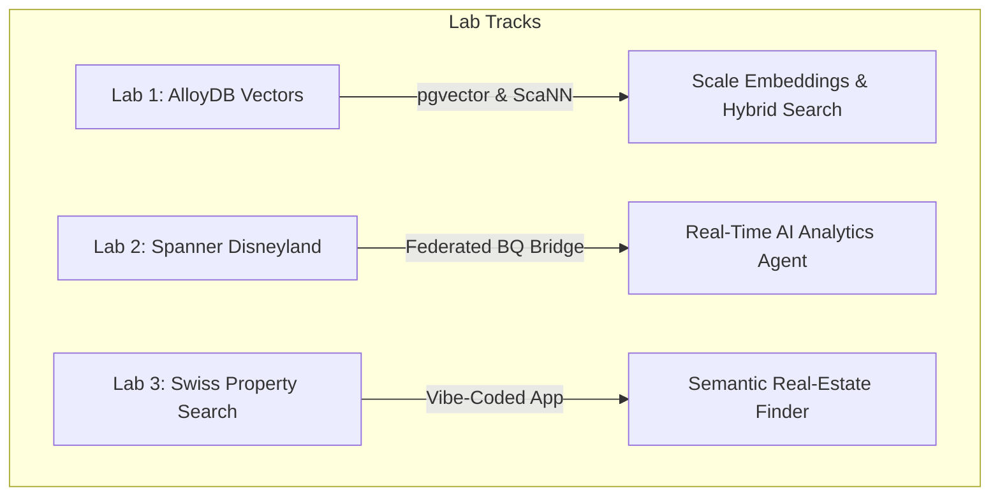

# Welcome to Google Cloud DACH Summit 2026: Hands-on Database Labs

Welcome, Hackathon Participants! This repository hosts the source code, configurations, and comprehensive step-by-step user guides for the **Google Cloud DACH Summit 2026 Hands-on Database Codelabs**. 

During this session, you will build advanced AI-powered database integrations, transactional bridges, and fullstack semantic search applications using state-of-the-art Google Cloud database features.

---

## 🗺️ Navigation & Codelabs Architecture

You can choose your focus area or complete all three codelabs sequentially. Each directory contains a standalone user guide to help you navigate the deployment.



---

## 🚀 The Three Labs

### 1. [Lab 1: One Million Vectors, Zero Loops (AlloyDB Vectors)](labs/01_alloydb_vectors/user_guide.md)
Learn to manage vector embeddings at scale without complex ETL pipelines or custom Python worker scripts.
- **Key Tech**: AlloyDB AI, pgvector, and **Google ScaNN (Scalable Nearest Neighbors)** vector indexes.
- **Highlights**: Bulk-backfill 50,000+ rows using a single native database command, automate real-time vectorization for future records using transactional triggers, and run hybrid cosine similarity + SQL filter search queries.

### 2. [Lab 2: Disneyland Agentic Codelab (Spanner & BigQuery)](labs/02_spanner_disneyland/user_guide.md)
Build a zero-copy federated analytical "bridge" between a transactional database and your data warehouse.
- **Key Tech**: Cloud Spanner, BigQuery connection objects, and the **MCP Toolbox** for agentic AI tooling.
- **Highlights**: Infrastructure provisioning using Terraform, injecting live Disneyland datasets into Spanner, running real-time BigQuery federated analytical lookups on transactional data, and configuring AI integrations.

### 3. [Lab 3: Swiss Property Search (Fullstack App & Vertex AI)](labs/03_fullstack_ai_app_property_search/user_guide.md)
Explore and extend a complete fullstack AI-powered search application vibe-coded entirely from scratch using Gemini.
- **Key Tech**: AlloyDB AI, Vertex AI (text-embedding-005), Gemini CLI, and Gemini Data Analytics endpoints.
- **Highlights**: Validating backend queryData APIs using shell scripts, and completing developer coding challenges (updating CSS branding palettes, building animated rainbow results popups, and generating dynamic architecture flow diagrams).

---

## ⚙️ Environment & Quick Start

To get started, ensure you are logged in to your Google Cloud account:

1. Open your **Google Cloud Shell** or connect to your pre-provisioned **Google Cloud Workstation**.
2. Clone this repository to your workspace (if not already cloned):
   ```bash
   git clone https://github.com/kupp0/google-dach-summit26-database-labs.git
   cd google-dach-summit26-database-labs
   ```
3. Navigate to the specific lab folder and open the `user_guide.md` to begin!

---

## 🛡️ Internal Operations Runbook
For workshop organizers and GCP project administrators, please refer to:
- **[Internal Notes & Pre-requisites](internal_notes.md)**: Project checklist, quota limits, and troubleshooting scripts.
- **[Infrastructure folder](infrastructure/README.md)**: Automated GCP environment, VPC networking, and Cloud Workstation workspace setup pipelines.
