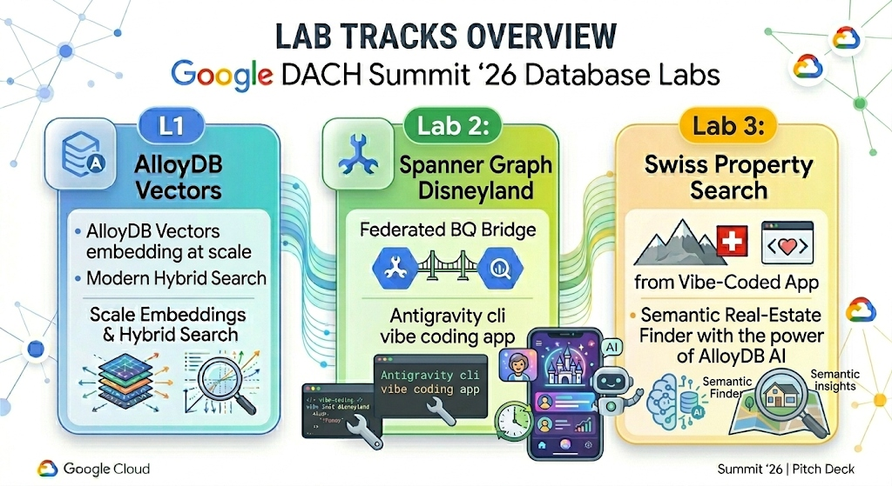

# Welcome to Google Cloud DACH Summit 2026: Hands-on Database Labs

Welcome, Hackathon Participants! This repository hosts the source code, configurations, and comprehensive step-by-step user guides for the **Google Cloud DACH Summit 2026 Hands-on Database Codelabs**. 

During this session, you will build advanced AI-powered database integrations, transactional bridges, and fullstack semantic search applications using state-of-the-art Google Cloud database features.

---

## 🗺️ Navigation & Codelabs Architecture

You can choose your focus area or complete all three codelabs sequentially. Each directory contains a standalone user guide to help you navigate the deployment.

---

## 🚀 The Three Labs

### 1. [Lab 1: One Million Vectors, Zero Loops (AlloyDB Vectors)](labs/01_alloydb_vectors/user_guide.md)
Learn to manage vector embeddings at scale without complex ETL pipelines or custom Python worker scripts.
- **Key Tech**: AlloyDB AI, pgvector, and **Google ScaNN (Scalable Nearest Neighbors)** vector indexes.
- **Highlights**: Bulk-backfill 50,000+ rows using a single native database command, automate real-time vectorization for future records using transactional triggers, and run hybrid cosine similarity + SQL filter search queries.

### 2. [Lab 2: Disneyland Agentic Codelab (Spanner & BigQuery)](labs/02_spanner_disneyland/user_guide.md)
Build a zero-copy federated analytical "bridge" between a transactional database and your data warehouse.
- **Key Tech**: Cloud Spanner, BigQuery connection objects, and the **MCP Toolbox** for agentic AI tooling.
- **Highlights**: Infrastructure provisioning using Terraform, injecting live Disneyland datasets into Spanner, running real-time BigQuery federated analytical lookups on transactional data, and configuring AI integrations.

### 3. [Lab 3: Swiss Property Search (Fullstack AI App & Gemini Data Analytics)](labs/03_fullstack_ai_app_property_search/user_guide.md)
Build and deploy a premium fullstack real-estate search application leveraging natural language queries via Gemini Data Analytics.
- **Key Tech**: AlloyDB, Gemini Data Analytics (GDA) QueryData API, Google Antigravity (ADK) SDK, and Model Context Protocol (MCP) Toolbox.
- **Highlights**: Provisioning database structures, generating visual assets natively via Vertex AI Imagen, registering a GDA Context Set for schema mapping, running a local stateless backend container stack, and building multi-turn conversational chat agents using the ADK SDK.

