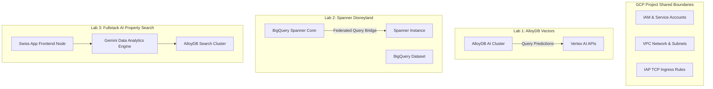

# Internal Infrastructure Setup Notes: DACH Summit 2026 Database Labs

This internal operational runbook provides the setup, variables, and configurations necessary for organizing, provisioning, and troubleshooting the infrastructure of the three hands-on database labs during the Google Cloud DACH Summit 2026.

---

## 1. Multi-Lab Infrastructure Overview



---

## 2. Summit Pre-requisites & Quota Checklist

Ensure the following regional quotas are requested at least **48 hours** before the summit event begins:

| Service | Metric Name | Required Quota | Primary Region | Fallback Region |
| :--- | :--- | :--- | :--- | :--- |
| **AlloyDB** | AlloyDB Clusters | 2 | `europe-west1` | `us-central1` |
| **AlloyDB** | AlloyDB CPU cores | 16 vCPUs | `europe-west1` | `us-central1` |
| **Cloud Spanner** | Spanner Processing Units | 100 PUs | `europe-west9` | `us-east1` |
| **BigQuery Connections** | BQ API Connection objects | 5 | `europe-west9` | `us-east1` |
| **Vertex AI** | text-embedding-005 Online Queries | 100,000 QPM | `europe-west1` | `us-central1` |

---

## 3. Lab 1 Setup Runbook: AlloyDB Vectors

### Primary Variables
- `PROJECT_ID` = *(Assigned per participant)*
- `REGION` = `europe-west1`
- `CLUSTER_ID` = `vector-cluster`
- `INSTANCE_ID` = `vector-primary`

### Automated IAM Activation
Before the lab, execute this script to ensure all participant service agents are successfully mapped to the Vertex AI User API role:
```bash
#!/bin/bash
# Run this script within each participant project boundary

PROJECT_ID=$(gcloud config get-value project)
PROJECT_NUMBER=$(gcloud projects describe $PROJECT_ID --format="value(projectNumber)")
SERVICE_ACCOUNT="service-${PROJECT_NUMBER}@gcp-sa-alloydb.iam.gserviceaccount.com"

echo "Binding roles/aiplatform.user to service account: ${SERVICE_ACCOUNT}"

gcloud projects add-iam-policy-binding ${PROJECT_ID} \
  --member="serviceAccount:${SERVICE_ACCOUNT}" \
  --role="roles/aiplatform.user"
```

### Common Failure Mode: IAM Propagation Lag
If a participant reports that `CALL ai.initialize_embeddings` returns a permission block, wait approximately 60 seconds for the Google Cloud IAM policy bindings to propagate through global directories.

---

## 4. Lab 2 Setup Runbook: Spanner Disneyland

### Primary Variables
- `PROJECT_ID` = *(Assigned per participant)*
- `REGION` = `europe-west9`
- `SPANNER_INSTANCE` = `disneyland`
- `SPANNER_DATABASE` = `agent-lab`
- `BQ_DATASET` = `disney`

### Terraform Execution Verification
Instruct participants to run their initial Terraform deployment non-interactively:
```bash
terraform init
terraform apply -var="project_id=$(gcloud config get-value project)" -auto-approve
```

### Post-Provisioning Singer Injection Validation
To verify the federated BigQuery connection is active immediately after deployment, query BQ external tables directly:
```bash
gcloud spanner rows insert --instance=disneyland --database=agent-lab \
  --table=Singers --data=SingerId=999,Name="Organizers Test Record"

bq query --use_legacy_sql=false \
  "SELECT * FROM \`$(gcloud config get-value project).disney.external_spanner_table\` WHERE SingerId=999"
```

---

## 5. Lab 3 Setup Runbook: Fullstack AI Property Search

### Primary Variables
- `PROJECT_ID` = *(Assigned per participant)*
- `REGION` = `europe-west1`
- `CLUSTER_ID` = `search-cluster`
- `INSTANCE_ID` = `search-primary`
- `DATABASE` = `search`
- `CONTEXT_SET` = `matthias`

### Port Management for AlloyDB Auth Proxy
If users are accessing the backend database locally from their Cloud Shell IDE, establish secure IAP-based tunnels:
```bash
# Start AlloyDB Auth Proxy in the background targeting port 5432
./alloydb-auth-proxy \
  "projects/$(gcloud config get-value project)/locations/europe-west1/clusters/search-cluster/instances/search-primary" \
  --port 5432 &
```

### Default Firewall Ingress Rules
Ensure the network network firewall has standard security tunnels opened for IAP:
```bash
gcloud compute firewall-rules create allow-ssh-ingress-from-iap \
  --network=default \
  --source-ranges=35.235.240.0/20 \
  --allow=tcp:22
```