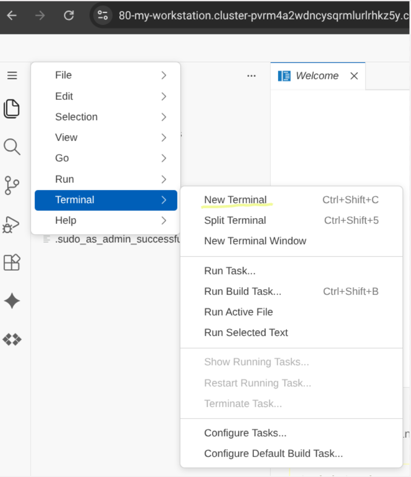

# Lab 2: Disneyland Agentic Codelab with Cloud Spanner & BigQuery

In this lab, you will build a zero-copy federated analytical "bridge" linking **Cloud Spanner** and **BigQuery**. This allows real-time analytic queries across transactional and warehouse data. Then, you'll deploy the **MCP Toolbox** to grant agentic AI tools the ability to query your transactional database in real-time.

---

## Objective
- Establish an external dataset mapping to automatically federate Cloud Spanner tables into BigQuery.
- Inject a rich Disneyland attraction dataset containing vector embeddings via Spanner Studio.
- Configure and verify the **MCP Toolbox** for agentic AI integration.
- Run verification federated queries in BigQuery Studio.

---

## Phase 1: Infrastructure Provisioning (Terraform)

The infrastructure is already deployed, if you are interested in the terraform code, you can find it in the [infrastructure](../../infrastructure) directory.

---

## Phase 2: Schema Creation & Data Injection

Populate Spanner database **`agent-lab`** with tables and data.

1. Go to the **Cloud Spanner** page in the Google Cloud Console.
2. Click on your Spanner instance **`disneyland`**, and then select database **`agent-lab`**.
3. In the left sidebar, click **Spanner Studio**.
4. Open a new query tab, paste the SQL script below, and click **Run**:

```sql
-- 1. Create DisneylandPark Table
CREATE TABLE DisneylandPark (
  ParkID INT64 NOT NULL,
  Name STRING(255) NOT NULL,
  Location STRING(255) NOT NULL
) PRIMARY KEY (ParkID);

-- 2. Create Attraction Table (with Vector Embedding field)
CREATE TABLE Attraction (
  AttractionID INT64 NOT NULL GENERATED BY DEFAULT AS IDENTITY (BIT_REVERSED_POSITIVE),
  ParkID INT64 NOT NULL,
  Name STRING(255) NOT NULL,
  Land STRING(100) NOT NULL,
  Type STRING(50) NOT NULL,
  Description STRING(MAX),
  Embedding ARRAY<FLOAT32>(vector_length=>3072)
) PRIMARY KEY (AttractionID);

ALTER TABLE Attraction ADD CONSTRAINT FK_Park FOREIGN KEY (ParkID) REFERENCES DisneylandPark(ParkID);

-- 3. Create Path Table (for graph routing/navigation)
CREATE TABLE Path (
  SourceAttractionID INT64 NOT NULL,
  TargetAttractionID INT64 NOT NULL,
  DistanceMeters INT64 NOT NULL,
  CONSTRAINT FK_SourceAttraction FOREIGN KEY (SourceAttractionID) REFERENCES Attraction(AttractionID),
  CONSTRAINT FK_TargetAttraction FOREIGN KEY (TargetAttractionID) REFERENCES Attraction(AttractionID)
) PRIMARY KEY (SourceAttractionID, TargetAttractionID);

-- 4. Create the Spanner Property Graph
CREATE OR REPLACE PROPERTY GRAPH DisneylandGraph
  NODE TABLES (
    Attraction
  )
  EDGE TABLES (
    Path
      SOURCE KEY (SourceAttractionID) REFERENCES Attraction (AttractionID)
      DESTINATION KEY (TargetAttractionID) REFERENCES Attraction (AttractionID)
  );

-- 5. Insert DisneylandPark Records
INSERT INTO DisneylandPark (ParkID, Name, Location) VALUES (1, 'Disneyland Park (Paris)', 'Paris, France');
INSERT INTO DisneylandPark (ParkID, Name, Location) VALUES (2, 'Walt Disney Studios Park', 'Paris, France');
INSERT INTO DisneylandPark (ParkID, Name, Location) VALUES (3, 'Disneyland Park (California)', 'Anaheim, USA');
INSERT INTO DisneylandPark (ParkID, Name, Location) VALUES (4, 'Disney California Adventure Park', 'Anaheim, USA');
INSERT INTO DisneylandPark (ParkID, Name, Location) VALUES (5, 'Tokyo Disneyland', 'Tokyo, Japan');

-- 6. Insert Attraction Records

INSERT INTO Attraction (AttractionID, ParkID, Name, Land, Type, Description) VALUES (1, 1, 'Disneyland Railroad Station', 'Main Street, U.S.A.', 'Transport', 'Board a vintage steam train for a scenic journey around the park.');
INSERT INTO Attraction (AttractionID, ParkID, Name, Land, Type, Description) VALUES (2, 1, 'Horse-Drawn Streetcars', 'Main Street, U.S.A.', 'Transport', 'Enjoy a nostalgic ride down Main Street in a turn-of-the-century streetcar.');
INSERT INTO Attraction (AttractionID, ParkID, Name, Land, Type, Description) VALUES (3, 1, 'Main Street Vehicles', 'Main Street, U.S.A.', 'Transport', 'Travel in style aboard a variety of vintage vehicles, like a fire engine or omnibus.');
INSERT INTO Attraction (AttractionID, ParkID, Name, Land, Type, Description) VALUES (4, 1, 'Liberty Arcade', 'Main Street, U.S.A.', 'Walkthrough', 'A covered walkway chronicling the creation of the Statue of Liberty.');
INSERT INTO Attraction (AttractionID, ParkID, Name, Land, Type, Description) VALUES (5, 1, 'Discovery Arcade', 'Main Street, U.S.A.', 'Walkthrough', 'A covered walkway showcasing scale models of futuristic inventions.');
INSERT INTO Attraction (AttractionID, ParkID, Name, Land, Type, Description) VALUES (6, 1, 'Dapper Dans Hair Cuts', 'Main Street, U.S.A.', 'Service', 'An old-fashioned barber shop offering traditional haircuts and shaves.');
INSERT INTO Attraction (AttractionID, ParkID, Name, Land, Type, Description) VALUES (7, 1, 'Big Thunder Mountain', 'Frontierland', 'Thrill Ride', 'A thrilling roller coaster that speeds through a haunted gold-mining town.');
INSERT INTO Attraction (AttractionID, ParkID, Name, Land, Type, Description) VALUES (8, 1, 'Phantom Manor', 'Frontierland', 'Dark Ride', 'A mysterious and spooky tour of a haunted mansion with ghostly residents.');
INSERT INTO Attraction (AttractionID, ParkID, Name, Land, Type, Description) VALUES (9, 1, 'Thunder Mesa Riverboat Landing', 'Frontierland', 'Boat Ride', 'A relaxing cruise on a majestic 19th-century paddle steamer.');
INSERT INTO Attraction (AttractionID, ParkID, Name, Land, Type, Description) VALUES (10, 1, 'Rustler Roundup Shootin Gallery', 'Frontierland', 'Game', 'Test your aim in this Wild West-themed shooting gallery.');
INSERT INTO Attraction (AttractionID, ParkID, Name, Land, Type, Description) VALUES (11, 1, 'Legends of the Wild West', 'Frontierland', 'Walkthrough', 'A scenic path through a frontier fort with encounters of famous Wild West figures.');
INSERT INTO Attraction (AttractionID, ParkID, Name, Land, Type, Description) VALUES (12, 1, 'River Rogue Keelboats', 'Frontierland', 'Boat Ride', 'A rustic keelboat voyage around Big Thunder Mountain and the Wilderness.');
INSERT INTO Attraction (AttractionID, ParkID, Name, Land, Type, Description) VALUES (13, 1, 'Pocahontas Indian Village', 'Frontierland', 'Playground', 'An outdoor play area for children, inspired by Native American culture.');
INSERT INTO Attraction (AttractionID, ParkID, Name, Land, Type, Description) VALUES (15, 1, 'Disneyland Railroad Station', 'Frontierland', 'Transport', 'Board the Disneyland Railroad from the heart of the Wild West.');
INSERT INTO Attraction (AttractionID, ParkID, Name, Land, Type, Description) VALUES (16, 1, 'The Chaparral Theater', 'Frontierland', 'Show', 'A large theater hosting spectacular live stage shows with Disney characters.');
INSERT INTO Attraction (AttractionID, ParkID, Name, Land, Type, Description) VALUES (17, 1, 'Pirates of the Caribbean', 'Adventureland', 'Boat Ride', 'A swashbuckling boat adventure through pirate-infested waters.');
INSERT INTO Attraction (AttractionID, ParkID, Name, Land, Type, Description) VALUES (18, 1, 'Indiana Jones and the Temple of Peril', 'Adventureland', 'Thrill Ride', 'A high-speed mine cart coaster through ancient jungle ruins.');
INSERT INTO Attraction (AttractionID, ParkID, Name, Land, Type, Description) VALUES (19, 1, 'Adventure Isle', 'Adventureland', 'Walkthrough', 'Explore a mysterious island full of caves, suspension bridges, and hidden treasures.');
INSERT INTO Attraction (AttractionID, ParkID, Name, Land, Type, Description) VALUES (20, 1, 'La Cabane des Robinson', 'Adventureland', 'Walkthrough', 'Climb the towering treehouse home of the Swiss Family Robinson.');
INSERT INTO Attraction (AttractionID, ParkID, Name, Land, Type, Description) VALUES (21, 1, 'Le Passage Enchanté dAladdin', 'Adventureland', 'Walkthrough', 'A walkthrough attraction depicting scenes from Disneys Aladdin.');
INSERT INTO Attraction (AttractionID, ParkID, Name, Land, Type, Description) VALUES (22, 1, 'La Plage des Pirates', 'Adventureland', 'Playground', 'A pirate-themed adventure playground for young buccaneers.');
INSERT INTO Attraction (AttractionID, ParkID, Name, Land, Type, Description) VALUES (23, 1, 'Le Château de la Belle au Bois Dormant', 'Fantasyland', 'Icon', 'The iconic Sleeping Beauty Castle, the centerpiece of Disneyland Park.');
INSERT INTO Attraction (AttractionID, ParkID, Name, Land, Type, Description) VALUES (24, 1, 'La Galerie de la Belle au Bois Dormant', 'Fantasyland', 'Walkthrough', 'Discover the story of Sleeping Beauty through stained glass and tapestries inside the castle.');
INSERT INTO Attraction (AttractionID, ParkID, Name, Land, Type, Description) VALUES (25, 1, 'La Tanière du Dragon', 'Fantasyland', 'Walkthrough', 'Venture into the dungeon beneath the castle to find a slumbering dragon.');
INSERT INTO Attraction (AttractionID, ParkID, Name, Land, Type, Description) VALUES (26, 1, 'its a small world', 'Fantasyland', 'Boat Ride', 'A gentle boat ride featuring singing dolls from all corners of the globe.');
INSERT INTO Attraction (AttractionID, ParkID, Name, Land, Type, Description) VALUES (27, 1, 'Peter Pans Flight', 'Fantasyland', 'Dark Ride', 'Soar over London and Never Land in a magical pirate galleon.');
INSERT INTO Attraction (AttractionID, ParkID, Name, Land, Type, Description) VALUES (28, 1, 'Blanche-Neige et les Sept Nains', 'Fantasyland', 'Dark Ride', 'Journey through the story of Snow White and the Seven Dwarfs.');
INSERT INTO Attraction (AttractionID, ParkID, Name, Land, Type, Description) VALUES (29, 1, 'Les Voyages de Pinocchio', 'Fantasyland', 'Dark Ride', 'Follow Pinocchio on his daring journey to become a real boy.');
INSERT INTO Attraction (AttractionID, ParkID, Name, Land, Type, Description) VALUES (30, 1, 'Dumbo the Flying Elephant', 'Fantasyland', 'Family Ride', 'Fly high above Fantasyland on your very own Dumbo.');
INSERT INTO Attraction (AttractionID, ParkID, Name, Land, Type, Description) VALUES (31, 1, 'Le Carrousel de Lancelot', 'Fantasyland', 'Family Ride', 'A classic carousel with beautifully decorated horses.');
INSERT INTO Attraction (AttractionID, ParkID, Name, Land, Type, Description) VALUES (32, 1, 'Mad Hatters Tea Cups', 'Fantasyland', 'Family Ride', 'Spin round and round in a giant teacup at a mad tea party.');
INSERT INTO Attraction (AttractionID, ParkID, Name, Land, Type, Description) VALUES (33, 1, 'Alices Curious Labyrinth', 'Fantasyland', 'Walkthrough', 'Get lost in a whimsical maze inspired by Alice in Wonderland.');
INSERT INTO Attraction (AttractionID, ParkID, Name, Land, Type, Description) VALUES (34, 1, 'Le Pays des Contes de Fées', 'Fantasyland', 'Boat Ride', 'A gentle boat trip through miniature scenes from classic Disney fairy tales.');
INSERT INTO Attraction (AttractionID, ParkID, Name, Land, Type, Description) VALUES (35, 1, 'Casey Jr. – le Petit Train du Cirque', 'Fantasyland', 'Family Ride', 'A charming little circus train that circles Storybook Land.');
INSERT INTO Attraction (AttractionID, ParkID, Name, Land, Type, Description) VALUES (36, 1, 'Disneyland Railroad Station', 'Fantasyland', 'Transport', 'Catch the steam train from the whimsical world of Fantasyland.');
INSERT INTO Attraction (AttractionID, ParkID, Name, Land, Type, Description) VALUES (37, 1, 'Meet Mickey Mouse', 'Fantasyland', 'Meet and Greet', 'Meet the one and only Mickey Mouse backstage at his theater.');
INSERT INTO Attraction (AttractionID, ParkID, Name, Land, Type, Description) VALUES (38, 1, 'Princess Pavilion', 'Fantasyland', 'Meet and Greet', 'Have a royal encounter with a Disney Princess in an enchanted setting.');
INSERT INTO Attraction (AttractionID, ParkID, Name, Land, Type, Description) VALUES (39, 1, 'Le théâtre du Château', 'Fantasyland', 'Show', 'An outdoor stage in front of the castle featuring musical performances.');
INSERT INTO Attraction (AttractionID, ParkID, Name, Land, Type, Description) VALUES (40, 1, 'Star Wars Hyperspace Mountain', 'Discoveryland', 'Thrill Ride', 'A high-speed roller coaster adventure through a Star Wars space battle.');
INSERT INTO Attraction (AttractionID, ParkID, Name, Land, Type, Description) VALUES (41, 1, 'Buzz Lightyear Laser Blast', 'Discoveryland', 'Interactive Ride', 'Help Buzz Lightyear defeat Emperor Zurg in this interactive space shooter.');
INSERT INTO Attraction (AttractionID, ParkID, Name, Land, Type, Description) VALUES (42, 1, 'Orbitron - Machines Volantes', 'Discoveryland', 'Family Ride', 'Pilot your own retro-futuristic spaceship as it orbits a giant planet model.');
INSERT INTO Attraction (AttractionID, ParkID, Name, Land, Type, Description) VALUES (43, 1, 'Star Tours: The Adventures Continue', 'Discoveryland', 'Simulator', 'A thrilling 3D motion-simulated space flight to different Star Wars planets.');
INSERT INTO Attraction (AttractionID, ParkID, Name, Land, Type, Description) VALUES (44, 1, 'Starport', 'Discoveryland', 'Meet and Greet', 'Encounter a mighty character from the Star Wars saga.');
INSERT INTO Attraction (AttractionID, ParkID, Name, Land, Type, Description) VALUES (45, 1, 'Discoveryland Theatre', 'Discoveryland', 'Show', 'A theater presenting seasonal shows and 3D film experiences.');
INSERT INTO Attraction (AttractionID, ParkID, Name, Land, Type, Description) VALUES (46, 1, 'Autopia', 'Discoveryland', 'Family Ride', 'Drive your own futuristic car along a winding track.');
INSERT INTO Attraction (AttractionID, ParkID, Name, Land, Type, Description) VALUES (47, 1, 'Les Mystères du Nautilus', 'Discoveryland', 'Walkthrough', 'Explore Captain Nemos legendary submarine from 20,000 Leagues Under the Sea.');
INSERT INTO Attraction (AttractionID, ParkID, Name, Land, Type, Description) VALUES (48, 1, 'Disneyland Railroad Station', 'Discoveryland', 'Transport', 'The final stop for the Disneyland Railroad, located in the land of tomorrow.');
INSERT INTO Attraction (AttractionID, ParkID, Name, Land, Type, Description) VALUES (49, 1, 'Arcade Alpha & Arcade Bêta', 'Discoveryland', 'Arcade', 'A video game arcade with a mix of classic and modern games.');
INSERT INTO Attraction (AttractionID, ParkID, Name, Land, Type, Description) VALUES (50, 1, 'Videopolis Theatre', 'Discoveryland', 'Show', 'A huge indoor venue for live shows, often with a nearby restaurant.');

-- 7. Insert Path Records

INSERT INTO Path (SourceAttractionID, TargetAttractionID, DistanceMeters) VALUES (1, 2, 70);
INSERT INTO Path (SourceAttractionID, TargetAttractionID, DistanceMeters) VALUES (1, 3, 60);
INSERT INTO Path (SourceAttractionID, TargetAttractionID, DistanceMeters) VALUES (2, 1, 70);
INSERT INTO Path (SourceAttractionID, TargetAttractionID, DistanceMeters) VALUES (2, 4, 80);
INSERT INTO Path (SourceAttractionID, TargetAttractionID, DistanceMeters) VALUES (2, 6, 50);
INSERT INTO Path (SourceAttractionID, TargetAttractionID, DistanceMeters) VALUES (3, 1, 60);
INSERT INTO Path (SourceAttractionID, TargetAttractionID, DistanceMeters) VALUES (3, 5, 80);
INSERT INTO Path (SourceAttractionID, TargetAttractionID, DistanceMeters) VALUES (3, 6, 50);
INSERT INTO Path (SourceAttractionID, TargetAttractionID, DistanceMeters) VALUES (4, 2, 80);
INSERT INTO Path (SourceAttractionID, TargetAttractionID, DistanceMeters) VALUES (4, 6, 40);
INSERT INTO Path (SourceAttractionID, TargetAttractionID, DistanceMeters) VALUES (4, 11, 140);
INSERT INTO Path (SourceAttractionID, TargetAttractionID, DistanceMeters) VALUES (4, 21, 120);
INSERT INTO Path (SourceAttractionID, TargetAttractionID, DistanceMeters) VALUES (5, 3, 80);
INSERT INTO Path (SourceAttractionID, TargetAttractionID, DistanceMeters) VALUES (5, 6, 40);
INSERT INTO Path (SourceAttractionID, TargetAttractionID, DistanceMeters) VALUES (5, 23, 100);
INSERT INTO Path (SourceAttractionID, TargetAttractionID, DistanceMeters) VALUES (5, 42, 100);
INSERT INTO Path (SourceAttractionID, TargetAttractionID, DistanceMeters) VALUES (6, 2, 50);
INSERT INTO Path (SourceAttractionID, TargetAttractionID, DistanceMeters) VALUES (6, 3, 50);
INSERT INTO Path (SourceAttractionID, TargetAttractionID, DistanceMeters) VALUES (6, 4, 40);
INSERT INTO Path (SourceAttractionID, TargetAttractionID, DistanceMeters) VALUES (6, 5, 40);
INSERT INTO Path (SourceAttractionID, TargetAttractionID, DistanceMeters) VALUES (7, 10, 100);
INSERT INTO Path (SourceAttractionID, TargetAttractionID, DistanceMeters) VALUES (7, 12, 60);
INSERT INTO Path (SourceAttractionID, TargetAttractionID, DistanceMeters) VALUES (7, 15, 80);
INSERT INTO Path (SourceAttractionID, TargetAttractionID, DistanceMeters) VALUES (8, 9, 70);
INSERT INTO Path (SourceAttractionID, TargetAttractionID, DistanceMeters) VALUES (8, 11, 90);
INSERT INTO Path (SourceAttractionID, TargetAttractionID, DistanceMeters) VALUES (9, 8, 70);
INSERT INTO Path (SourceAttractionID, TargetAttractionID, DistanceMeters) VALUES (9, 10, 60);
INSERT INTO Path (SourceAttractionID, TargetAttractionID, DistanceMeters) VALUES (10, 7, 100);
INSERT INTO Path (SourceAttractionID, TargetAttractionID, DistanceMeters) VALUES (10, 9, 60);
INSERT INTO Path (SourceAttractionID, TargetAttractionID, DistanceMeters) VALUES (10, 11, 50);
INSERT INTO Path (SourceAttractionID, TargetAttractionID, DistanceMeters) VALUES (11, 4, 140);
INSERT INTO Path (SourceAttractionID, TargetAttractionID, DistanceMeters) VALUES (11, 8, 90);
INSERT INTO Path (SourceAttractionID, TargetAttractionID, DistanceMeters) VALUES (11, 10, 50);
INSERT INTO Path (SourceAttractionID, TargetAttractionID, DistanceMeters) VALUES (12, 7, 60);
INSERT INTO Path (SourceAttractionID, TargetAttractionID, DistanceMeters) VALUES (13, 15, 110);
INSERT INTO Path (SourceAttractionID, TargetAttractionID, DistanceMeters) VALUES (13, 16, 90);
INSERT INTO Path (SourceAttractionID, TargetAttractionID, DistanceMeters) VALUES (15, 7, 80);
INSERT INTO Path (SourceAttractionID, TargetAttractionID, DistanceMeters) VALUES (15, 13, 110);
INSERT INTO Path (SourceAttractionID, TargetAttractionID, DistanceMeters) VALUES (16, 13, 90);
INSERT INTO Path (SourceAttractionID, TargetAttractionID, DistanceMeters) VALUES (16, 17, 150);
INSERT INTO Path (SourceAttractionID, TargetAttractionID, DistanceMeters) VALUES (17, 16, 150);
INSERT INTO Path (SourceAttractionID, TargetAttractionID, DistanceMeters) VALUES (17, 21, 80);
INSERT INTO Path (SourceAttractionID, TargetAttractionID, DistanceMeters) VALUES (17, 22, 60);
INSERT INTO Path (SourceAttractionID, TargetAttractionID, DistanceMeters) VALUES (18, 20, 130);
INSERT INTO Path (SourceAttractionID, TargetAttractionID, DistanceMeters) VALUES (19, 20, 50);
INSERT INTO Path (SourceAttractionID, TargetAttractionID, DistanceMeters) VALUES (19, 22, 70);
INSERT INTO Path (SourceAttractionID, TargetAttractionID, DistanceMeters) VALUES (20, 18, 130);
INSERT INTO Path (SourceAttractionID, TargetAttractionID, DistanceMeters) VALUES (20, 19, 50);
INSERT INTO Path (SourceAttractionID, TargetAttractionID, DistanceMeters) VALUES (20, 22, 40);
INSERT INTO Path (SourceAttractionID, TargetAttractionID, DistanceMeters) VALUES (21, 4, 120);
INSERT INTO Path (SourceAttractionID, TargetAttractionID, DistanceMeters) VALUES (21, 17, 80);
INSERT INTO Path (SourceAttractionID, TargetAttractionID, DistanceMeters) VALUES (21, 22, 50);
INSERT INTO Path (SourceAttractionID, TargetAttractionID, DistanceMeters) VALUES (22, 17, 60);
INSERT INTO Path (SourceAttractionID, TargetAttractionID, DistanceMeters) VALUES (22, 19, 70);
INSERT INTO Path (SourceAttractionID, TargetAttractionID, DistanceMeters) VALUES (22, 20, 40);
INSERT INTO Path (SourceAttractionID, TargetAttractionID, DistanceMeters) VALUES (22, 21, 50);
INSERT INTO Path (SourceAttractionID, TargetAttractionID, DistanceMeters) VALUES (22, 28, 160);
INSERT INTO Path (SourceAttractionID, TargetAttractionID, DistanceMeters) VALUES (23, 5, 100);
INSERT INTO Path (SourceAttractionID, TargetAttractionID, DistanceMeters) VALUES (23, 24, 20);
INSERT INTO Path (SourceAttractionID, TargetAttractionID, DistanceMeters) VALUES (23, 25, 30);
INSERT INTO Path (SourceAttractionID, TargetAttractionID, DistanceMeters) VALUES (23, 31, 60);
INSERT INTO Path (SourceAttractionID, TargetAttractionID, DistanceMeters) VALUES (24, 23, 20);
INSERT INTO Path (SourceAttractionID, TargetAttractionID, DistanceMeters) VALUES (25, 23, 30);
INSERT INTO Path (SourceAttractionID, TargetAttractionID, DistanceMeters) VALUES (26, 34, 70);
INSERT INTO Path (SourceAttractionID, TargetAttractionID, DistanceMeters) VALUES (26, 38, 80);
INSERT INTO Path (SourceAttractionID, TargetAttractionID, DistanceMeters) VALUES (26, 45, 180);
INSERT INTO Path (SourceAttractionID, TargetAttractionID, DistanceMeters) VALUES (27, 28, 40);
INSERT INTO Path (SourceAttractionID, TargetAttractionID, DistanceMeters) VALUES (27, 31, 50);
INSERT INTO Path (SourceAttractionID, TargetAttractionID, DistanceMeters) VALUES (28, 22, 160);
INSERT INTO Path (SourceAttractionID, TargetAttractionID, DistanceMeters) VALUES (28, 27, 40);
INSERT INTO Path (SourceAttractionID, TargetAttractionID, DistanceMeters) VALUES (28, 29, 40);
INSERT INTO Path (SourceAttractionID, TargetAttractionID, DistanceMeters) VALUES (29, 28, 40);
INSERT INTO Path (SourceAttractionID, TargetAttractionID, DistanceMeters) VALUES (29, 30, 40);
INSERT INTO Path (SourceAttractionID, TargetAttractionID, DistanceMeters) VALUES (30, 29, 40);
INSERT INTO Path (SourceAttractionID, TargetAttractionID, DistanceMeters) VALUES (30, 31, 60);
INSERT INTO Path (SourceAttractionID, TargetAttractionID, DistanceMeters) VALUES (31, 23, 60);
INSERT INTO Path (SourceAttractionID, TargetAttractionID, DistanceMeters) VALUES (31, 27, 50);
INSERT INTO Path (SourceAttractionID, TargetAttractionID, DistanceMeters) VALUES (31, 30, 60);
INSERT INTO Path (SourceAttractionID, TargetAttractionID, DistanceMeters) VALUES (32, 33, 50);
INSERT INTO Path (SourceAttractionID, TargetAttractionID, DistanceMeters) VALUES (33, 32, 50);
INSERT INTO Path (SourceAttractionID, TargetAttractionID, DistanceMeters) VALUES (33, 37, 90);
INSERT INTO Path (SourceAttractionID, TargetAttractionID, DistanceMeters) VALUES (34, 26, 70);
INSERT INTO Path (SourceAttractionID, TargetAttractionID, DistanceMeters) VALUES (34, 35, 50);
INSERT INTO Path (SourceAttractionID, TargetAttractionID, DistanceMeters) VALUES (35, 34, 50);
INSERT INTO Path (SourceAttractionID, TargetAttractionID, DistanceMeters) VALUES (35, 36, 60);
INSERT INTO Path (SourceAttractionID, TargetAttractionID, DistanceMeters) VALUES (36, 35, 60);
INSERT INTO Path (SourceAttractionID, TargetAttractionID, DistanceMeters) VALUES (36, 37, 70);
INSERT INTO Path (SourceAttractionID, TargetAttractionID, DistanceMeters) VALUES (37, 33, 90);
INSERT INTO Path (SourceAttractionID, TargetAttractionID, DistanceMeters) VALUES (37, 36, 70);
INSERT INTO Path (SourceAttractionID, TargetAttractionID, DistanceMeters) VALUES (38, 26, 80);
INSERT INTO Path (SourceAttractionID, TargetAttractionID, DistanceMeters) VALUES (38, 39, 40);
INSERT INTO Path (SourceAttractionID, TargetAttractionID, DistanceMeters) VALUES (39, 38, 40);
INSERT INTO Path (SourceAttractionID, TargetAttractionID, DistanceMeters) VALUES (39, 41, 130);
INSERT INTO Path (SourceAttractionID, TargetAttractionID, DistanceMeters) VALUES (40, 43, 90);
INSERT INTO Path (SourceAttractionID, TargetAttractionID, DistanceMeters) VALUES (40, 47, 50);
INSERT INTO Path (SourceAttractionID, TargetAttractionID, DistanceMeters) VALUES (41, 39, 130);
INSERT INTO Path (SourceAttractionID, TargetAttractionID, DistanceMeters) VALUES (41, 42, 60);
INSERT INTO Path (SourceAttractionID, TargetAttractionID, DistanceMeters) VALUES (41, 50, 70);
INSERT INTO Path (SourceAttractionID, TargetAttractionID, DistanceMeters) VALUES (42, 5, 100);
INSERT INTO Path (SourceAttractionID, TargetAttractionID, DistanceMeters) VALUES (42, 41, 60);
INSERT INTO Path (SourceAttractionID, TargetAttractionID, DistanceMeters) VALUES (42, 43, 70);
INSERT INTO Path (SourceAttractionID, TargetAttractionID, DistanceMeters) VALUES (43, 40, 90);
INSERT INTO Path (SourceAttractionID, TargetAttractionID, DistanceMeters) VALUES (43, 42, 70);
INSERT INTO Path (SourceAttractionID, TargetAttractionID, DistanceMeters) VALUES (43, 44, 30);
INSERT INTO Path (SourceAttractionID, TargetAttractionID, DistanceMeters) VALUES (44, 43, 30);
INSERT INTO Path (SourceAttractionID, TargetAttractionID, DistanceMeters) VALUES (45, 26, 180);
INSERT INTO Path (SourceAttractionID, TargetAttractionID, DistanceMeters) VALUES (45, 50, 40);
INSERT INTO Path (SourceAttractionID, TargetAttractionID, DistanceMeters) VALUES (46, 48, 100);
INSERT INTO Path (SourceAttractionID, TargetAttractionID, DistanceMeters) VALUES (47, 40, 50);
INSERT INTO Path (SourceAttractionID, TargetAttractionID, DistanceMeters) VALUES (48, 46, 100);
INSERT INTO Path (SourceAttractionID, TargetAttractionID, DistanceMeters) VALUES (48, 49, 60);
INSERT INTO Path (SourceAttractionID, TargetAttractionID, DistanceMeters) VALUES (49, 48, 60);
INSERT INTO Path (SourceAttractionID, TargetAttractionID, DistanceMeters) VALUES (49, 50, 50);
INSERT INTO Path (SourceAttractionID, TargetAttractionID, DistanceMeters) VALUES (50, 41, 70);
INSERT INTO Path (SourceAttractionID, TargetAttractionID, DistanceMeters) VALUES (50, 45, 40);
INSERT INTO Path (SourceAttractionID, TargetAttractionID, DistanceMeters) VALUES (50, 49, 50);
```

---

## Phase 3: Real-Time Bridge Verification Query

Validate that the zero-copy federated bridge is working correctly by executing a live query in BigQuery that fetches data directly from your Cloud Spanner transactional tables.

1. Go to the **BigQuery Studio** in the Google Cloud Console.
2. In the left Explorer sidebar, expand your project and you should see the **`disneyland_spanner_external`** dataset mapping all of your Spanner tables dynamically!
3. Open a new **SQL Query** tab.
4. Paste and run the query below (replace `YOUR_PROJECT_ID` with your actual project ID):

```sql
SELECT * 
FROM `YOUR_PROJECT_ID.disneyland_spanner_external.Attraction` 
LIMIT 5;
```

---

## Phase 4: Model Context Protocol (MCP) Agent Registry Verification

Once your Cloud Spanner database is successfully created and active, Spanner is automatically registered as a Google-managed MCP Server in the **Agent Registry** for Vertex AI.

To verify that the Spanner MCP Server is registered and available in your region:

Run this command directly in your Cloud Shell terminal. Alternatively, navigate to the [Managed MCP Servers](https://console.cloud.google.com/agent-platform/agent-registry/mcp-servers) in the Cloud Console:

```bash
gcloud alpha agent-registry mcp-servers list \
  --location=global \
  --format=json
```
*(Look for an entry related to Spanner in the output to confirm availability).*

---

## Phase 5: Building the Agentic Application using Antigravity CLI

In this phase, you will launch the **Antigravity CLI** directly from a terminal session within your **Cloud Workstation** and use it to build a complete web application. The application will utilize a FastAPI Python backend powered by the **AGY SDK** that queries your Spanner transactional database, coupled with a modern single-page HTML5/JS frontend client. It leverages **Spanner Graph** capabilities to perform navigation and pathfinding across Disneyland Paris attractions.

### 1. Open a Terminal in Cloud Workstations

To open a terminal session within your Cloud Workstation:
1. In the Google Cloud Console, navigate to the **Cloud Workstations** page.
2. Select your workstation instance and click **Launch** to open the browser-based editor UI.
3. In the top-left corner of the workstation window, click the application menu button.
4. Navigate to **Terminal** and select **New Terminal** (or use the keyboard shortcut `Ctrl+Shift+C`).



5. Once the terminal opens, you are ready to launch and configure the Antigravity CLI.

---

### 2. Initializing and Getting Started with the Antigravity CLI

First, navigate to your initialized lab workspace folder, and then launch the interactive Antigravity session:

```bash
cd ~/disneyland-navigator
antigravity
```
*(Note: You can launch the CLI by running the full `antigravity` command or by typing its quick shorthand alias `agy`).*

Upon running the CLI for the first time, complete the following setup flow:

1. **Authentication**: Follow the authentication flow by clicking on the provided link in your browser and sign in with your **Devstar** user credentials. Afterwards, copy the authorization code and paste it back into the terminal `agy` CLI session.
2. **GCP Project ID**: When prompted, enter your active **GCP Project ID**.
3. **Location & Theme**: Choose the `global` location, and then select your color theme of choice.
4. **Terms & Conditions**: Agree to the Terms and Conditions (T/C).
5. **Open Settings**: Open the session settings panel by typing:
   ```text
   /settings
   ```
6. **Auto-Approve**: Enable the **Auto Approve** setting to save time during your vibe coding journey, allowing the AI agent:
   - **Tool Permission**: always-proceed
   - **Artifact Review**: agent decides
7. **Verify Managed MCP Server**: Verify that the Google-managed Spanner MCP Server is correctly configured and connected by using the `/mcp` command. You should see a green Spanner icon in the top right corner of the terminal. This indicates that the agent can query your Spanner database and has access to the Disneyland schema and data.

Now you are ready to begin! Enjoy your vibe coding journey.

#### Essential Antigravity CLI Commands
Once inside the active Antigravity interactive shell, you can use the following slash commands to manage your session:

| Command | Action |
| :--- | :--- |
| `/list-sessions` | Shows a numbered list of your past session activities to resume. |
| `/resume latest` | Jumps back into your most recent active conversation. |
| `/exit` | Exits the interactive CLI session and returns to your standard terminal prompt. |
| `/settings` | Configures global behavior, themes, model configurations, and auto-approve options. |
| `/mcp` | Displays a list of active Model Context Protocol (MCP) servers and verifies their connection status. |

---

### 3. Prompting Antigravity to Generate the Agentic Application

Paste the following developer prompt into the active `agy` CLI interactive chat session to initiate code generation:

```text
Goal: Build a high-performance, beautiful Disneyland Paris Navigator application in 5-10 minutes.
Stack & Architecture: To bypass slow npm installations and build compilation steps, implement a clean FastAPI Python backend (app.py) paired with a rich, premium Single-Page HTML5/JS frontend (index.html) utilizing Tailwind CSS via CDN.
Infrastructure Context: I have provisioned a Cloud Spanner instance called "disneyland" and a database called "agent-lab" in this Google Cloud project.

Database DDL & Property Graph Schema:
Use the existing Spanner schema and property graph defined as follows:
- Table 'DisneylandPark' (ParkID INT64, Name STRING, Location STRING)
- Table 'Attraction' (AttractionID INT64, ParkID INT64, Name STRING, Land STRING, Type STRING, Description STRING, Embedding ARRAY<FLOAT32>)
- Table 'Path' (SourceAttractionID INT64, TargetAttractionID INT64, DistanceMeters INT64)
- Property Graph:
  CREATE OR REPLACE PROPERTY GRAPH DisneylandGraph
    NODE TABLES (Attraction)
    EDGE TABLES (Path SOURCE KEY (SourceAttractionID) REFERENCES Attraction (AttractionID) DESTINATION KEY (TargetAttractionID) REFERENCES Attraction (AttractionID));

Agent & Integration Model: Integrate the AI Agent using the Google Antigravity (google-antigravity) Python SDK, utilizing the pre-installed custom skills available in your workspace (`skills/spanner-graph` and `skills/vertex-config`) to resolve model names, active GCP Project/credentials context, and Spanner GQL queries. Connect the agent to the Google-managed Spanner Model Context Protocol (MCP) Server registered under the Vertex AI Agent Registry (location: global).
Instructions:
- Show the planning phase of development first. Create the implementation plan inside the project directory and open it in OSS code after creation.
- Backend (app.py): Use FastAPI to expose endpoints.
  - Endpoint /api/chat: Uses the google-antigravity SDK Agent (configured with the Spanner MCP server) to handle conversational database querying dynamically.
  - Endpoint /api/navigate: Executes custom Spanner Graph MATCH queries on the "DisneylandGraph" property graph to find optimized routes. Expose the executed Spanner SQL and Graph GQL queries in the API responses.
- Frontend (index.html): Create a premium, immersive Disneyland-themed user interface (glassmorphic cards, deep navy and sparkling royal gold colors, hover micro-animations).
  - Features: Interactive pathfinder (source -> target attraction displaying path nodes and total distance), search filter, and a terminal-style Chat component connected to /api/chat.
  - Add a "View Queries" button/panel to the top of the UI to allow users to inspect the exact Spanner SQL/GQL queries executed by the Agent and backend.
- Startup Script (setup.sh): For local debugging, create an automated startup shell script that initializes a Python virtual environment, installs fastapi, uvicorn, google-antigravity, runs app.py, and opens the dashboard in the browser.
```

---

### 4. Run and Explore your Vibe Coded Application

Here's an example Vibe coded Disneyland navigator app! Once the Antigravity agent has finished writing the application:

1. **Run the App Locally**: Launch your app by executing `bash setup.sh` inside your terminal, which will spin up your local FastAPI server.
   
   > [!TIP]
   > **Accessing Port 8000 on Cloud Workstations**:
   > Since you are using Cloud Workstations, when you run the application, the web-based Code-OSS editor will automatically detect that port 8000 has been opened and display a popup in the bottom right corner. Click **Open in Browser** to view the live dashboard.

2. **Check Spanner Graph**: Go to the **Cloud Spanner Studio** in the Google Cloud Console and examine the generated Spanner Graph definition to see how the property graph structure is laid out.
3. **Inspect the Code**: Open the generated directory to see how clean the codebase is! Read the FastAPI backend (`app.py`) to see how it uses the `google-antigravity` SDK to chat with Spanner.
4. **Ask Questions**: If you want any specific parts of the implementation explained, simply ask inside your active `agy` CLI session to get code walk-throughs and technical details!

---

### 5. Deep Dive: Spanner Graph Queries under the Hood

When the agent calls the pathfinding tools, it runs a native **Spanner Graph** query using the `GRAPH_TABLE` function on the property graph defined on the `Attraction` and `Path` tables.

For example, the tool `find_shortest_path_between_two_attractions` resolves under the hood to:

```sql
SELECT * 
FROM GRAPH_TABLE(DisneylandGraph
  MATCH p = (src:Attraction {Name: 'Phantom Manor'})
        -[:Path]->{1,5}(dest:Attraction {Name: 'Big Thunder Mountain'})
  RETURN 
    src.Name AS Source, 
    dest.Name AS Target, 
    (SELECT SUM(e.DistanceMeters) FROM UNNEST(edges(p)) AS e) AS TotalDistanceMeters
);
```

This zero-copy Spanner Graph structure enables instant pathfinding logic inside your AI agent without needing extra external graph databases or complex application-level traversal algorithms.

---

## Phase 6: Troubleshooting & Pro-Tips

* **🪄 The Vibe-Coding Playground is Yours!**: Structured rails? Where we are going, we don't need rails! 🚀 You have successfully set up the core infrastructure. Now, the **Antigravity CLI** (`agy`) is your personal genie—and unlike standard genies, it doesn't have a three-wish limit. Feel free to prompt it to build whatever wacky, premium, or hyper-engineered features you can dream of!
  Need some inspiration to flex your vibe-coding muscles?
  - 🎢 **Churro-Metric Navigation**: Ask it to calculate the optimal route between Space Mountain and Big Thunder Mountain based on how many jumbo Disneyland churros you can consume while walking.
  - 🐭 **Mickey Voice Mode**: Prompt the AI agent to format all conversational chat responses in the squeaky, optimistic tone of Mickey Mouse himself.
  - 🚀 **Hyperdrive Mode**: Add a button that triggers a flashy warp-speed CSS particle effect whenever Space Mountain is clicked.
  - 🔍 **Semantic Attraction Search**: As you learned in Lab 01, vector embeddings enable semantic search capabilities. Ask the AI to generate vector embeddings of the attractions (the `Embedding ARRAY<FLOAT32>(vector_length=>3072)` column already exists in the `Attraction` table). Let the AI generate the embeddings of the attraction descriptions and add a semantic attraction search widget to your UI.
  
  Unleash your imagination, type your heart out in the `agy` CLI session, and let the AI do the heavy lifting. Have fun, and enjoy your vibe coding journey! 🏰✨

---

## Clean Up

> [!WARNING]
> **Ongoing Costs (if you're using your own Google Cloud project)**:
> To avoid incurring ongoing charges for resources created during the lab (like the regional Spanner instance), please destroy all provisioned infrastructure when you have completed the lab:
> `terraform destroy`
