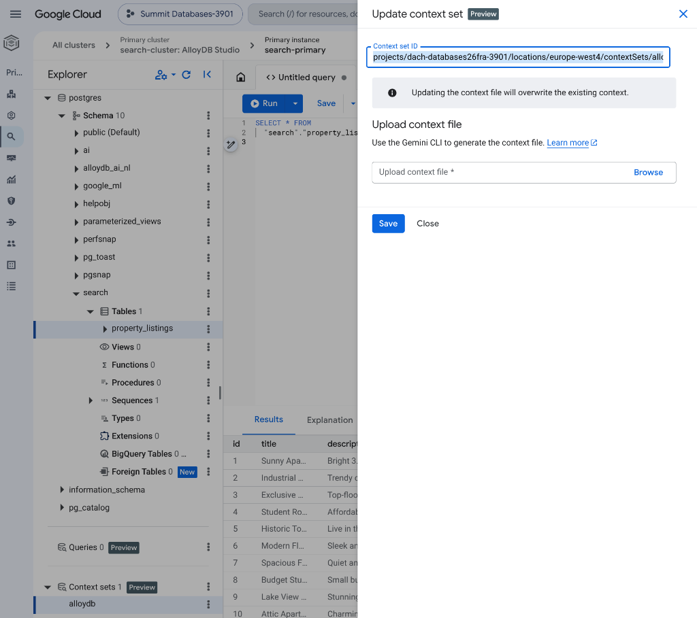
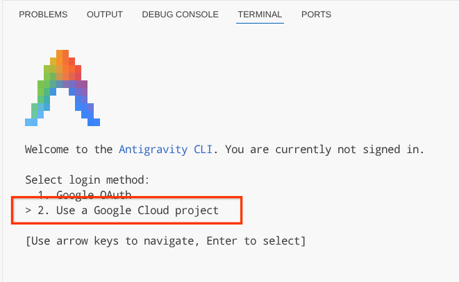

# 🇨🇭 Lab 3: Swiss Property Search — Fullstack AI App with AlloyDB & Gemini Data Analytics

Welcome, Future Real Estate Moguls! 🏰

Who doesn't dream of owning a cozy chalet in the Swiss Alps? In this lab, you will build and deploy a premium, high-performance real-estate search application leveraging the state-of-the-art **Gemini Data Analytics (GDA) QueryData API** alongside **AlloyDB**. We'll hook up a beautiful natural language search engine and deploy a multi-turn AI chat agent powered by the **Google Antigravity SDK**. Let's build a search experience so slick and premium that Swiss private bankers would be jealous!

---

## 🎯 Lab Objectives
* **💾 Database Setup**: Ingest property listings and backfill vector embeddings natively in AlloyDB (no loops, purely database-driven).
* **🧠 Context Mapping**: Register a GDA **Context Set** so the model learns to map natural language queries directly to SQL structures.
* **💻 Sandbox Stack Execution**: Spin up the microservices architecture locally via Docker containers (with an optional Cloud Run deploy).
* **🤖 Agentic Customization**: Deploy the **Antigravity CLI (agy)** to customize and style your application codebase autonomously!

---

## 🏗️ Phase 1: Architecture & Workspace Setup

### 📂 1. Open the Workspace Folder in Cloud Workstations
1. In your Cloud Workstation window, select **File** -> **Open Folder**.
2. Type `/home/user/lab03_swiss_property_search` and click **OK**.
3. Open a terminal by selecting **Terminal** -> **New Terminal** (or press `Ctrl+Shift+C`).

### 🗺️ 2. Workspace File Architecture
Your workspace `/home/user/lab03_swiss_property_search` contains:
* **`alloydb-artefacts/`**: SQL scripts, Context mapping JSON, pre-configured database assets, and database proxies.
* **`backend/`**: FastAPI backend (`main.py`), Agent definition, and MCP configuration.
* **`frontend/`**: React + Vite frontend source code.
* **`deploy.sh`**: Deploys the completed stack to serverless Cloud Run.
* **`debug_local.sh`**: Compiles and spins up the application stack inside local Docker containers.

### 🔑 3. Initialize Environment & Authorize Access
First, authenticate both the `gcloud` CLI and Application Default Credentials (ADC) if they are not already set:

```bash
# Checks if authenticated; if not, triggers the login flow
if [ -z "$(gcloud config get-value account 2>/dev/null)" ] || [ ! -f ~/.config/gcloud/application_default_credentials.json ]; then gcloud auth login --update-adc; fi
```
*(If prompted, sign in using your Google account and paste the authorization code into the terminal).*

Then, ensure your active project is set (if it wasn't pre-configured automatically by the workstation bootstrap):

```bash
gcloud config set project <YOUR_PROJECT_ID>
```
*(Replace `<YOUR_PROJECT_ID>` with your assigned project ID, e.g. `dach-databases26fra-3904`).*

Next, navigate to the lab workspace and run the setup initialization script:

```bash
cd ~/lab03_swiss_property_search
bash init.sh
```
> [!TIP]
> This script takes about **2-3 minutes** to provision GCP resources (bastion host, storage bucket, registry repository) and install baseline dependencies. It also automatically grants your active user credentials `roles/iap.tunnelResourceAccessor` permissions on the GCP project to enable database access.
> (Replace `<YOUR_PROJECT_ID>` with your assigned project ID, e.g. `dach-databases26fra-3904`).

## 🗄️ Phase 2: Database Setup & Data Ingestion

### 💾 1. Database Setup & SQL Initialization
1. In the Google Cloud Console, navigate to **AlloyDB** -> **Clusters**.
2. Click on your cluster `search-cluster` and select the primary instance `search-primary`.
3. In the left panel, click **AlloyDB Studio** and sign in:
   * **Authentication Method**: `IAM Database Authentication` (or `IAM`)
   * **Username**: Enter your Google Cloud account email (e.g. `devstar39xx@gcplab.me`)
   * *(Note: Signing in with IAM is a prerequisite for the Query Data Tool to generate context sets in a later step).*
4. Open a **new query tab**, copy and run the contents of `alloydb-artefacts/alloydb_setup.sql`.
5. Open a **second query tab**, copy and run the contents of `alloydb-artefacts/insert_listings.sql` to ingest all listing records with pre-computed image paths and image embeddings.
6. Open a **third query tab**, and run the database-native batch embedding backfill to calculate description embeddings:
   ```sql
   CALL ai.initialize_embeddings(
     model_id => 'gemini-embedding-001',
     table_name => 'property_listings',
     content_column => 'description',
     embedding_column => 'description_embedding',
     incremental_refresh_mode => 'transactional',
     batch_size => 50
   );
   ```
   *(This procedure runs natively inside the database, calling the Gemini embedding model in batches of 50 to avoid rate limits. It also configures real-time triggers for future inserts).*
   
   To monitor the backfill progress, you can run:
   ```sql
   SELECT * FROM ai.embedding_progress_view;
   ```
7. Open a **fourth query tab**, copy and run the contents of `alloydb-artefacts/alloydb_indexes.sql` to build the ScaNN vector search indexes.
8. Run the query below to verify records populated successfully (should return 232 listings):
   ```sql
   SELECT count(*) as property_count FROM property_listings;
   ```


---

## 🧠 Phase 3: Registering Gemini Data Analytics Context Set

GDA uses Context Sets to map database schemas to natural language definitions.

1. In the Google Cloud Console, search for **Gemini Data Analytics** or **Data Agents**.
2. Go to the **Context Sets** panel and click **Create Context Set**.
3. Upload the file `/home/user/lab03_swiss_property_search/alloydb-artefacts/alloydb_context.json`.
   
   > [!NOTE]
   > If you see a warning/error in the console stating: **"To use this feature, enable data_api_access for this instance."**, you can manually enable it by running this command in your Cloud Workstation terminal:
   > ```bash
   > curl -X PATCH \
   >   -H "Authorization: Bearer \$(gcloud auth print-access-token)" \
   >   -H "Content-Type: application/json" \
   >   "https://alloydb.googleapis.com/v1alpha/projects/<PROJECT_ID>/locations/<REGION>/clusters/<CLUSTER_ID>/instances/<INSTANCE_ID>?updateMask=dataApiAccess" \
   >   -d '{"dataApiAccess": "ENABLED"}'
   > ```
   > *(Replace `<PROJECT_ID>`, `<REGION>`, `<CLUSTER_ID>`, and `<INSTANCE_ID>` with your project details, e.g. `dach-databases26fra-3901`, `europe-west3`, `search-cluster`, and `search-primary`)*

4. Once created, copy the generated **Context Set ID** (a UUID or string identifier).
   
   

5. **🔬 Test the Context Set in AlloyDB Studio**:
   * Scroll to the bottom of the left **Explorer** panel in AlloyDB Studio to locate **Context sets**.
   * Click the three vertical dots next to your created context set (or right-click it) and select **Query data using context set**.
   * Type plain English questions (e.g., *"Show me apartments in Zurich with at least 2 bedrooms"*) and verify SQL translation and output results instantly.

6. Open the environment file `backend/.env` in the workstation editor.
7. Update the variable `AGENT_CONTEXT_SET_ID_ALLOYDB` with your copied Context Set ID:
   ```env
   AGENT_CONTEXT_SET_ID_ALLOYDB=your_copied_context_set_id
   ```
8. Save the file.

---

## 🚀 Phase 4: Deploying & Running the Application

### 💻 1. Run and Debug Locally
To run and debug the entire application locally in your workstation environment:
1. In the terminal, run the local debug script:
   ```bash
   cd ~/lab03_swiss_property_search
   bash debug_local.sh
   ```
   *(This starts the remote proxy tunnel, builds the local docker images, and spins up the backend, frontend, agent, and toolbox containers. Keep this terminal open).*
2. Copy the local frontend address `http://localhost:8081` (or click on the port 8081 popup in the bottom right of the workstation window) to access the application UI. Verify that **Natural Language Search** and **AI Agent Chat** are functional.
3. Press `Ctrl+C` in the terminal when you are ready to stop the containers and proxy.

### ☁️ 2. (Optional) Deploy Serverless to Cloud Run
To optionally push the application live to serverless Cloud Run:
1. In the terminal, run the deployment shell script:
   ```bash
   cd ~/lab03_swiss_property_search
   bash deploy.sh
   ```
   *(This builds container images via Cloud Build, creates/updates the tools secret in Secret Manager, and deploys 3 services: backend, frontend, and agent (with toolbox sidecar) to Cloud Run).*
2. Once the script finishes, copy the output **Frontend URL** and open it in your browser to verify functionality.

---

## 🏆 Phase 5: Hands-On Agentic Coding Challenges

Now use the **Antigravity CLI (agy)** or your AI Assistant inside the workspace `/home/user/lab03_swiss_property_search` to expand and style the application.

> [!IMPORTANT]
> **Antigravity CLI Launch**:
> Launch the interactive terminal agent in your workspace:
> ```bash
> cd ~/lab03_swiss_property_search
> agy
> ```
> When running `agy` for the first time, you will be prompted with login choices. Select **2. Use a Google Cloud project** as the login method:
> 
> 
> 
> Use the arrow keys to navigate and press **Enter** to select. Then, provide the active Google Cloud project ID (e.g. `hackathon-prep-499508`).


### 🔮 Challenge 1: Architecture Exploration & UML Generation
* **Goal**: Analyze the workspace architecture and generate a sequence flow diagram.
* **Prompt**: *"Analyze this repository, provide a concise directory summary, and visualize the message flow of a search query through the system with a PlantUML sequence diagram. Save the diagram source as PlantUML and render it as a PNG."*

### 🍒 Challenge 2: Apply Premium Branding (Swiss Red)
* **Goal**: Change the color scheme of the frontend application to Swiss Red.
* **Prompt**: *"Please change the color scheme of the frontend application in the repository to Swiss Red. Consider background colors, secondary highlights, button states, dark mode, and light mode. Ensure all modifications conform to vanilla CSS standard styles."*

### 🌈 Challenge 3: Flashy Row-Count Success Popup
* **Goal**: Celebrate successful database queries with a fun row count animation.
* **Prompt**: *"Modify the frontend results-handling logic. Post-QueryData success, extract the exact row count returned in the GDA response. Display an animated 10-second 'flashy' rainbow-colored congratulatory popup celebrating the returned row count."*

---

## 🔧 Troubleshooting & Pro-Tips

* **🤖 Ask your AI Assistant (`agy` CLI)**: If you get stuck on any coding challenge, or if you need clarification on how the backend connects to Gemini Data Analytics, you can ask questions directly in your active `agy` CLI session (e.g., *"Explain how the GDA QueryData endpoint works in main.py"* or *"Help me implement the rainbow celebratory popup in App.jsx"*).

