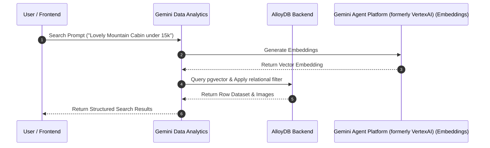

# Lab 3: Swiss Property Search: Fullstack AI App with AlloyDB & Gemini Agent Platform (formerly VertexAI)

In this track, you will build and deploy a premium real-estate search application that showcases three different ways to execute AI-powered semantic and relational searches. The entire project was vibe-coded from scratch using Gemini and uses **AlloyDB**, **Gemini Agent Platform (formerly VertexAI)**, and **Gemini Data Analytics Query Data Tool** as its core backend.

---

## Objective
- Explore the architecture of the Switzerland Property Search fullstack application.
- Test the Gemini Data Analytics backend using a shell script and custom payloads.
- Complete hands-on **Antigravity CLI Coding Challenges** to modify, style, and enhance the application in real-time.

---

## Phase 1: Architecture & Setup Blueprint

### What We Are Building
You will deploy a complete backend and front-end interface for a Swiss real-estate application. The application enables two search modalities:
1. **Semantic Search**: A vector-based lookup in AlloyDB that compares user search queries with the high-dimensional vector embeddings of property descriptions and property images.
2. **Natural Language Querying (NLQ)**: Queries translated to SQL to retrieve exact matching records from AlloyDB.



### Onboarding & Infrastructure Links
- **Core Infrastructure Blueprint**: Refer to the baseline repo for standard setup: [Bootkon pr2pr Repository](https://github.com/mikrovvelle/bootkon/blob/pr2pr/content/pr2pr/README.md)
- **Background Inspiration**: Read the story behind the application on [Matthias Kupczak's Blog Post](https://medium.com/@matthiaskupczak/genai-everywhere-building-a-full-stack-ai-search-demo-with-alloydb-vertex-ai-and-agentic-37eb38c3e646).

- **Next '26 Presentation**: Check out the Google Cloud Next 26 presentation about Data Agents and the Data Query Tool (NL2SQL):
  - 📄 [Official Presentation Slides](https://content-cdn.sessionboard.com/content/6XCkKXeZTfmxxblcF7MH_BRK3-003.pdf)
  - 🎥 [YouTube Session Recording](https://www.youtube.com/watch?v=GMVF9KNIqP4&t=2s)

---

## Phase 2: Testing the Backend API

Validate that your Gemini Data Analytics API and AlloyDB datasource references are connected correctly using the shell script below.

### Create the Test Script (`test-gda.sh`)
Create a file named `test-gda.sh`, paste the script below, and execute it:

```bash
#!/bin/bash

# --- HARDCODED TESTING VARIABLES ---
# Replace these placeholder values with your actual GCP details
GCP_PROJECT_ID="YOUR_PROJECT_ID"
GCP_LOCATION="europe-west3"
ALLOYDB_CLUSTER_ID="search-cluster"
ALLOYDB_INSTANCE_ID="search-primary"
DB_NAME="search"
AGENT_CONTEXT_SET_ID_ALLOYDB="projects/${GCP_PROJECT_ID}/locations/${GCP_LOCATION}/contextSets/matthias"
# -----------------------------------

PROJECT_ID=${GCP_PROJECT_ID:-$(gcloud config get-value project)}
GDA_LOCATION=${GCP_LOCATION:-"europe-west1"}
API_ENDPOINT="https://geminidataanalytics.googleapis.com/v1beta/projects/${PROJECT_ID}/locations/${GDA_LOCATION}:queryData"

# Semantic query prompt
PROMPT="Show me Lovely Mountain Cabins under 15k"

echo "Testing backend: AlloyDB"

# AlloyDB Datasource Payload Definition
read -r -d '' DATASOURCE_REF << INNER_EOF
      "alloydb": {
        "databaseReference": {
          "project_id": "${PROJECT_ID}",
          "region": "${GDA_LOCATION}",
          "cluster_id": "${ALLOYDB_CLUSTER_ID}",
          "instance_id": "${ALLOYDB_INSTANCE_ID}",
          "database_id": "${DB_NAME}"
        },
        "agentContextReference": {
          "context_set_id": "${AGENT_CONTEXT_SET_ID_ALLOYDB}"
        }
      }
INNER_EOF

# Retrieve OAuth token
TOKEN=$(gcloud auth print-access-token)

if [ -z "$TOKEN" ]; then
    echo "Failed to get gcloud auth token. Ensure you are authenticated."
    exit 1
fi

# Full JSON Request Payload
read -r -d '' JSON_PAYLOAD << INNER_EOF
{
  "parent": "projects/${PROJECT_ID}/locations/${GDA_LOCATION}",
  "prompt": "${PROMPT}",
  "context": {
    "datasourceReferences": {
${DATASOURCE_REF}
    }
  },
  "generation_options": {
    "generate_query_result": true,
    "generate_natural_language_answer": true,
    "generate_explanation": true,
    "generate_disambiguation_question": true
  }
}
INNER_EOF

echo "Sending request to endpoint: ${API_ENDPOINT}"
echo "Payload:"
echo "${JSON_PAYLOAD}"
echo "---"

# Execute POST request using curl
curl -X POST \
  -H "Authorization: Bearer ${TOKEN}" \
  -H "Content-Type: application/json; charset=utf-8" \
  -d "${JSON_PAYLOAD}" \
  "${API_ENDPOINT}"

echo
```

---

## Phase 3: Hands-On Agentic Coding Challenges (Antigravity CLI)

Once your Swiss Property Search application is deployed and verified, use the **Antigravity CLI (agy)** or your AI Coding Assistant to enhance and expand the application.

### Challenge 1: Architecture Exploration & UML Generation
Analyze the workspace structure and generate a UML representation:
- **Prompt**: *"Analyze this repository, provide a concise directory summary, and visualize the message flow of a search query through the system with a PlantUML sequence diagram. Save the diagram source as PlantUML and render it as a PNG."*

### Challenge 2: Apply Premium Branding (Swiss Red)
Adapt the design system of the frontend application to match the Swiss national branding:
- **Prompt**: *"Please change the color scheme of the frontend application in the repository to Swiss Red. Consider background colors, secondary highlights, button states, dark mode, and light mode. Ensure all modifications conform to vanilla CSS standard styles."*

### Challenge 3: Flashy Row-Count Success Popup
Add interactive user feedback following successful queries:
- **Prompt**: *"Modify the frontend results-handling logic. Post-QueryData success, extract the exact row count returned in the API response. Display an animated 10-second 'flashy' rainbow-colored congratulatory popup celebrating the returned row count. Refer to test-gda.sh for API response structure."*

---

## Troubleshooting

### IAP Tunneling and Firewall Connectivity Issues
If you encounter connection issues or IAP proxy failures when starting your AlloyDB Auth Proxy, run the following commands in your Cloud Shell:

```bash
# 1. Grant IAP Tunnel Access to your Cloud Account
gcloud projects add-iam-policy-binding $(gcloud config get-value project) \
  --member="user:$(gcloud config get-value account)" \
  --role="roles/iap.tunnelResourceAccessor"

# 2. Allow Ingress TCP Traffic from Google's IAP range
gcloud compute firewall-rules create allow-ssh-ingress-from-iap \
  --network=default \
  --source-ranges=35.235.240.0/20 \
  --allow=tcp:22
```
